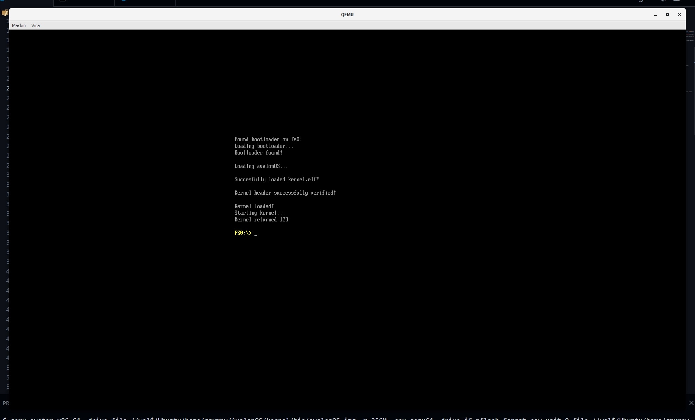

# Welcome to Avalon Studio
### A free operating system
###### Copyright (c) 2022 Lithicsoft Inc

# Screenshot

# Download
It not ready now, but it will come soon

# How to run?
You can run it with Vbox or VMware

# FAQ
### What is AvalonOS?
AvalonOS is an operating system by Avalon Studio \
In 2022, it created by pengu

### Is AvalonOS a Linux distribution?
No, AvalonOS runs its own kernel that does not originate from Linux

### What is special about AvalonOS?
AvalonOS has its own Bootloader write with C, ps2 mouse-keyborad, and a good gui

### Where can it run?
It can run on x86_64 CPUs and requires at least 2G of ram
